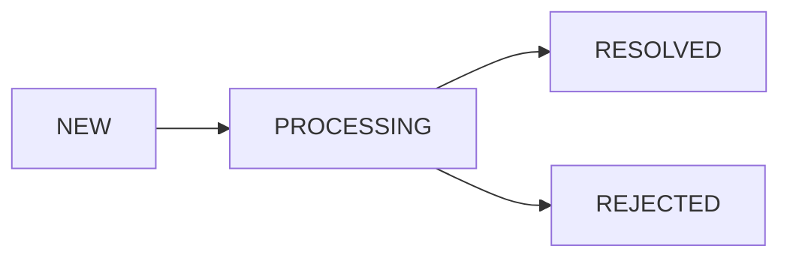
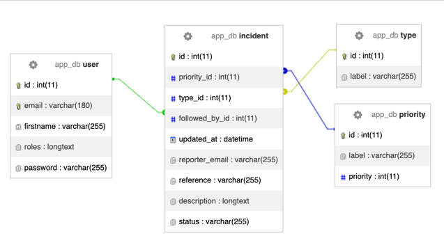

 
# SQL Triggers

## Description
Projet contenant une base de données MariaDb et un PHPMyAdmin ayant pour finalité
de s'initier et s'entrainer à la création de triggers SQL.

Ce projet présente la base de données d'une application de gestion de tickets d'incidents.

Un utilisateur anonyme déclare un incident, ce dernier sera ensuite affilié à un utilisateur (Technicien support)
enregistré afin qu'il le traite.

### Workflow de traitement d'un ticket

### Schéma de la BDD de l'application



## Installation

Un fichier `docker-compose.yaml` est fourni, ainsi il suffit de démarrer les services. 
Ce dernier importe automatoquement la base de données
- `docker compose up -d`

Vous pouvez ensuite accéder à PHPMyAdmin, à l'adresse suivante :
- [http://localhost:8081](https://localhost:8081)

## Documentation

### Definition

Un "trigger" en SQL est une procédure automatique, une série d'instructions ou une règle définie dans
une base de données qui est déclenchée en réponse à un événement spécifique.
Ces événements peuvent inclure des opérations de modification de données telles que l'insertion, la mise à jour ou 
la suppression de lignes dans une table.
Lorsque l'événement se produit, le trigger SQL s'exécute automatiquement, permettant aux développeurs de définir 
des actions personnalisées pour gérer les données de manière cohérente et réactive. Les triggers SQL sont couramment
utilisés pour appliquer des règles métier, maintenir l'intégrité des données, effectuer des audits ou automatiser
des tâches spécifiques au niveau de la base de données.

### Exemples
#### Trigger DML (Data Manipulation Language) :
##### Trigger INSERT 
Ce type de trigger se déclenche lorsqu'une nouvelle ligne est insérée dans une table. 
```SQL
    -- Trigger BEFORE INSERT
    DELIMITER //
    CREATE TRIGGER tr_before_insert_employee
        BEFORE INSERT
        ON employes
        FOR EACH ROW
    BEGIN
        -- Vérification de la date de naissance
        IF NEW.date_naissance >= '2000-01-01' THEN
            SIGNAL SQLSTATE '45000'
            SET MESSAGE_TEXT = 'La date de naissance doit être antérieure à 2000-01-01';
    END IF;
    
    -- Autres vérifications et validations avant l'insertion
    -- ...
    END;
    //
    DELIMITER ;
    
    -- Trigger AFTER INSERT
    DELIMITER //
    CREATE TRIGGER tr_after_insert_employee
        AFTER INSERT
        ON employes
        FOR EACH ROW
    BEGIN
        -- Enregistrement dans le journal d'audit
        INSERT INTO journal_audit (action, description, date)
        VALUES ('INSERT', CONCAT('Nouvel employé ajouté : ', NEW.nom), NOW());
    END;
    //
    DELIMITER ;
```
Dans cet exemple, le premier trigger "BEFORE INSERT" vérifie la date de naissance du nouvel employé et signale 
une erreur si elle est postérieure au 1er janvier 2000. 

Le deuxième trigger "AFTER INSERT" enregistre l'ajout de l'employé dans une table de journal d'audit, 
enregistrant l'action "INSERT" et le nom de l'employé nouvellement ajouté, ainsi que la date et l'heure de l'opération.

##### Trigger UPDATE
Ce type de trigger se déclenche lorsqu'une ligne existante dans une table est mise à jour.

```SQL
    -- Trigger BEFORE UPDATE
    DELIMITER //
    CREATE TRIGGER tr_before_update_product
        BEFORE UPDATE
        ON produits
        FOR EACH ROW
    BEGIN
        -- Vérification de la quantité en stock
        IF NEW.stock < 0 THEN
            SIGNAL SQLSTATE '45000'
            SET MESSAGE_TEXT = 'La quantité en stock ne peut pas être négative.';
    END IF;
    
    -- Autres vérifications et validations avant la mise à jour
    -- ...
    END;
    //
    DELIMITER ;
    
    -- Trigger AFTER UPDATE
    DELIMITER //
    CREATE TRIGGER tr_after_update_product
        AFTER UPDATE
        ON produits
        FOR EACH ROW
    BEGIN
        -- Enregistrement dans le journal d'audit
        INSERT INTO journal_audit (action, description, date)
        VALUES ('UPDATE', CONCAT('Produit mis à jour : ', OLD.nom, ' => ', NEW.nom), NOW());
    END;
    //
    DELIMITER ;
```
Dans cet exemple, le premier trigger "BEFORE UPDATE" vérifie la quantité en stock du produit avant de permettre
la mise à jour. Si la quantité en stock devient négative, il signale une erreur. 

Le deuxième trigger "AFTER UPDATE" enregistre la mise à jour du produit dans une table de journal d'audit, 
enregistrant l'action "UPDATE" ainsi que l'ancien et le nouveau nom du produit, la date et l'heure de l'opération.

##### Trigger DELETE
Ce type de trigger se déclenche lorsque des lignes sont supprimées d'une table.

```SQL
    -- Trigger BEFORE DELETE
    DELIMITER //
    CREATE TRIGGER tr_before_delete_client
        BEFORE DELETE
        ON clients
        FOR EACH ROW
    BEGIN
        -- Vérification de l'existence de commandes associées
        DECLARE commandes_count INT;
        SELECT COUNT(*) INTO commandes_count
        FROM commandes
        WHERE client_id = OLD.client_id;
    
        IF commandes_count > 0 THEN
            SIGNAL SQLSTATE '45000'
            SET MESSAGE_TEXT = 'Impossible de supprimer ce client, des commandes sont associées.';
    END IF;
    
    -- Autres vérifications et validations avant la suppression
    -- ...
    END;
    //
    DELIMITER ;
    
    -- Trigger AFTER DELETE
    DELIMITER //
    CREATE TRIGGER tr_after_delete_client
     AFTER DELETE ON clients
    FOR EACH ROW
    BEGIN
        -- Enregistrement dans le journal d'audit
        INSERT INTO journal_audit (action, description, date)
        VALUES ('DELETE', CONCAT('Client supprimé : ', OLD.nom), NOW());
    END;
    //
    DELIMITER ;
```

Dans cet exemple, le premier trigger "BEFORE DELETE" vérifie s'il existe des commandes associées au client que
l'on souhaite supprimer. Si des commandes sont associées, il empêche la suppression du client en signalant une erreur.

Le deuxième trigger "AFTER DELETE" enregistre la suppression du client dans une table de journal d'audit, 
enregistrant l'action "DELETE" ainsi que le nom du client supprimé, la date et l'heure de l'opération.

#### Trigger DDL (Data Definition Language) :
Trigger DDL (par exemple, un événement CREATE TABLE) : Les triggers DDL sont moins courants, mais ils peuvent être
utilisés pour capturer des événements de modification de la structure de la base de données, tels que la création ou
la suppression de tables. Voici un exemple hypothétique de création d'un trigger qui enregistre chaque fois 
qu'une nouvelle table est créée dans la base de données.

```SQL
    CREATE TRIGGER tr_create_table AFTER CREATE ON DATABASE
    BEGIN
        INSERT INTO journal_audit_structure (action, description, date)
        VALUES ('CREATE TABLE', 'Nouvelle table créée : ' + TABLE_NAME, NOW());
    END;
```

Notez que la syntaxe et la disponibilité des triggers DDL peuvent varier en fonction du système de 
gestion de base de données (SGBD) que vous utilisez, et que tous les SGBD ne prennent pas en charge les triggers DDL.
